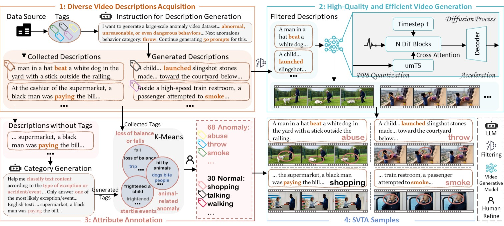

<div align="center">
<h2>📄🔎🎞️Towards Scalable Video Anomaly Retrieval: A Synthetic Video-Text Benchmark</h2>

[Shuyu Yang](https://scholar.google.com/citations?hl=zh-CN&user=U8sKsVYAAAAJ), [Yilun Wang](), [Yaxiong Wang](https://scholar.google.com/citations?user=lDChiR4AAAAJ&hl=zh-CN), [Li Zhu](https://scholar.google.com/citations?user=OinO73IAAAAJ&hl=zh-CN), [Zhedong Zheng](https://scholar.google.com/citations?user=XT17oUEAAAAJ&hl=zh-CN)

<a href='https://arxiv.org/abs/2506.01466'></a>
<a href='https://svta-mm.github.io/SVTA.github.io/'></a>
<a href='https://www.kaggle.com/datasets/shuyuyang666/svta-synthetic-video-text-anomaly-benchmark'></a>
<!-- views since 25.06 -->
</div>

<p align="center">

</p>

***Abstract:*** 
Video anomaly retrieval aims to localize anomalous events in videos using 
natural language queries to facilitate public safety. However, existing 
datasets suffer from severe limitations: **(1) data scarcity due to the 
long-tail nature of real-world anomalies**, and **(2) privacy constraints that 
impede large-scale collection**. To address the aforementioned issues in one go, 
we introduce **SVTA** (**S**ynthetic **V**ideo-**T**ext **A**nomaly benchmark), the first large-scale 
dataset for cross-modal anomaly retrieval, leveraging generative models to 
overcome data availability challenges. Specifically, we collect and generate 
video descriptions via the off-the-shelf LLM (Large Language Model) covering 
68 anomaly categories, e.g., throwing, stealing, and shooting. These descriptions 
encompass common long-tail events. We adopt these texts to guide the video 
generative model to produce diverse and high-quality videos. Finally, our SVTA 
involves **41,315 videos** (1.36M frames) with paired captions, covering **30 normal 
activities**, e.g., standing, walking, and sports, and **68 anomalous events**, e.g., 
falling, fighting, theft, explosions, and natural disasters. We adopt three 
widely-used video-text retrieval baselines to comprehensively test our SVTA, 
revealing SVTA's challenging nature and its effectiveness in evaluating a robust 
cross-modal retrieval method. SVTA eliminates privacy risks associated with 
real-world anomaly collection while maintaining realistic scenarios.


## Benchmark

| Datasets      |   Modality   |    Annotation    | Anno. Format | #Videos | #Texts  | #Anomaly Types | Anomaly : Normal | Data source |
|---------------|:------------:|:----------------:|:------------:|:-------:|:-------:|:--------------:|:----------------:|:-----------:|
| UBnormal      |    Video     | Frame-level Tag  | Action Label |   543   |    -    |   22 Anomaly   |       2:3        |  Synthesis  |
| ShanghaiTech  |    Video     | Frame-level Tag  | Action Label |   437   |    -    |   11 Anomaly   |       1:18       | Collection  |
| UCF-Crime     |    Video     | Video-level Tag  | Action Label |  1,900  |    -    |   13 Anomaly   |       1:1        | Collection  |
| UCA           | Video, Text  | Video-level Text | Action Text  |  1,900  | 23,542  |   13 Anomaly   |       1:1        | Collection  |
| UCFCrime-AR   | Video, Text  | Video-level Text | Action Text  |  1,900  |  1,900  |   13 Anomaly   |       1:1        | Collection  |
| SVTA (Ours)   | Video, Text  | Video-level Text | Action Text  | 41,315  | 41,315  |   68 Anomaly   |       3:2        |  Synthesis  |

Comparison of the proposed SVTA dataset and some of the other publicly available datasets 
for anomaly detection and anomaly retrieval. Our dataset provides many more video samples, 
action classes (anomaly and normal), and background in comparison with other available 
datasets for anomaly retrieval (Anno. means Annotation).


<p align="center">

</p>
Pipeline of our Synthetic Video-Text Anomaly (SVTA) benchmark construction. 

* First, we collect and generate diverse video descriptions via LLM. 

* Second, we leverage a state-of-the-art open-source video generative model 
to craft high-quality videos. 

* Third, we adopt LLM to assign preliminary attributes for samples lacking 
explicit normal/anomaly labels and refine all labels by K-Means clustering 
and manual verification. 

* The final dataset integrates 41,315 rigorously curated video-text pairs.

More dataset statistics and analysis can be seen in our [paper](https://arxiv.org/abs/2506.01466).


## Experiment

We comprehensively evaluate three video-text retrieval baseline models on SVTA, i.e., 
[CLIP4Clip](https://github.com/ArrowLuo/CLIP4Clip), 
[X-CLIP](https://github.com/xuguohai/X-CLIP), 
and [GRAM](https://github.com/ispamm/GRAM). 
The results reveal the challenging nature of SVTA and its effectiveness in 
training robust cross-modal anomaly retrieval models.


| Method               |          |          |    T2V    |          |          |          |          |    V2T     |          |          |
|----------------------|:--------:|:--------:|:---------:|:--------:|:--------:|:--------:|:--------:|:----------:|:--------:|:--------:|
|                      | **R@1↑** | **R@5↑** | **R@10↑** | **MdR↓** | **MnR↓** | **R@1↑** | **R@5↑** | **R@10↑**  | **MdR↓** | **MnR↓** |
| CLIP4Clip-MeanP      |   54.0   |   81.7   |   88.9    |   1.0    |   8.8    |   55.8   |   82.5   |    89.4    |   1.0    |   7.9    |
| CLIP4Clip-seqLSTM    |   53.9   |   81.7   |   88.7    |   1.0    |   8.7    |   55.7   |   82.4   |    89.4    |   1.0    |   7.8    |
| CLIP4Clip-seqTransf  |   55.4   |   82.6   |   89.4    |   1.0    |   7.9    |   55.7   |   82.9   |    89.7    |   1.0    |   7.6    |
| CLIP4Clip-tightTransf|   46.3   |   75.6   |   84.7    |   2.0    |   15.3   |   46.9   |   76.2   |    85.2    |   2.0    |   16.3   |
| X-CLIP (ViT-B/32)    |   52.9   |   79.9   |   88.1    |   1.0    |   9.0    |   52.9   |   80.2   |    87.9    |   1.0    |   9.4    |
| X-CLIP (ViT-B/16)    |   55.8   |   82.2   |   89.6    |   1.0    |   8.0    |   56.2   |   82.1   |    89.4    |   1.0    |   8.1    |
| GRAM                 |   57.3   |   82.0   |   88.7    |   1.0    |  130.5   |   56.5   |   81.6   |    88.3    |   1.0    |  137.9   |

Multimodal text-to-video (T2V) and video-to-text (V2T) retrieval results in terms of 
Recall Rate (R@1, R@5, R@10), Median Rank (MdR), and Mean Rank (MnR) on SVTA.
It should be noted that GRAM employs additional re-ranking techniques, 
resulting in significantly higher (i.e., worse) Mean Rank (MnR) values 
compared to CLIP4Clip and X-CLIP.
These results collectively underscore the challenging nature of SVTA 
as a benchmark dataset.


<p align="center">

</p>
Some retrieved examples of GRAM on SVTA. 
We visualize top 3 retrieved videos (green: correct; orange: incorrect).


| Method               |          |          |    T2V    |          |          |          |          |    V2T    |          |          |
|----------------------|:--------:|:--------:|:---------:|:--------:|:--------:|:--------:|:--------:|:---------:|:--------:|:--------:|
|                      | **R@1↑** | **R@5↑** | **R@10↑** | **MdR↓** | **MnR↓** | **R@1↑** | **R@5↑** | **R@10↑** | **MdR↓** | **MnR↓** |
| CLIP4Clip-MeanP      |   23.6   |   50.0   |   63.0    |   5.5    |   15.7   |   16.7   |   39.5   |   54.1    |   9.0    |   22.6   |
| CLIP4Clip-seqLSTM    |   22.9   |   49.0   |   64.4    |   6.0    |   16.0   |   18.4   |   36.1   |   52.4    |   10.0   |   23.5   |
| CLIP4Clip-seqTransf  |   24.0   |   47.6   |   64.0    |   6.0    |   16.1   |   17.7   |   36.4   |   51.0    |   10.0   |   22.4   |
| CLIP4Clip-tightTransf|   16.8   |   41.4   |   53.4    |   8.0    |   32.9   |   14.3   |   34.0   |   49.0    |   12.0   |   39.4   |
| X-CLIP (ViT-B/32)    |   24.0   |   49.7   |   63.4    |   6.0    |   16.4   |   17.7   |   36.4   |   52.7    |   9.0    |   22.7   |
| X-CLIP (ViT-B/16)    |   27.4   |   53.1   |   67.8    |   5.0    |   14.0   |   20.4   |   44.6   |   59.5    |   7.0    |   19.6   |
| GRAM                 |   34.5   |   60.7   |   70.7    |   3.0    |   17.8   |   32.4   |   57.2   |   68.6    |   4.0    |   26.3   |

Zero-shot multimodal text-to-video (T2V) and video-to-text (V2T) retrieval results 
in terms of Recall Rate (R@1, R@5, R@10), Median Rank (MdR), and Mean Rank (MnR) on UCFCrime-AR.
More cross-domain generalization experiments can be seen in our [paper](https://arxiv.org/abs/2506.01466).


## Citation

Please cite this paper if it helps your research:

```bibtex
@article{yang2025towards,
  title={Towards Scalable Video Anomaly Retrieval: A Synthetic Video-Text Benchmark},
  author={Yang, Shuyu and Wang, Yilun and Wang, Yaxiong and Zhu, Li and Zheng, Zhedong},
  booktitle={arXiv preprint arXiv:2506.01466},
  year={2025},
}
```

## **Acknowledgement**

This repository is benefit from [Wan2.1](https://github.com/Wan-Video/Wan2.1), 
[TeaCache](https://github.com/ali-vilab/TeaCache), 
and [DiffSynth-Studio](https://github.com/modelscope/DiffSynth-Studio). 
Thanks for the open-sourcing work! 
We would also like to thank to the great projects
in [CLIP4Clip](https://github.com/ArrowLuo/CLIP4Clip), 
[X-CLIP](https://github.com/xuguohai/X-CLIP), 
and [GRAM](https://github.com/ispamm/GRAM).
